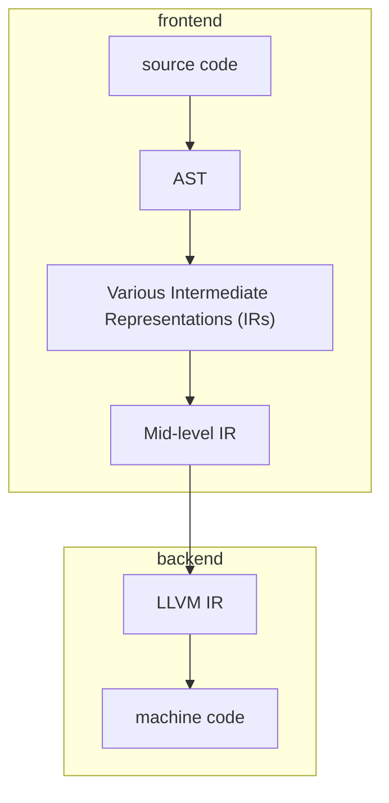

# Tetanus

This is my 1L project, a RV64GC rust native backend for the rust compiler.
At time of writing, im building directly off of a fork of the rust compiler, which is this repo, so theres a lot of existing Rustc code!
Below is main Rustc repo.

## Why?

Rust compile times are slow.
This is one of the fundamental tradeoffs for the language; slow compile times in exchange for catching more issues at compile time.
However, for debug builds developer velocity is more important than fancy machine code optimizations.

#### a simplified overview of the rust compiler pipeline

The Rust compiler typically spends about 2/3 of its time in the "frontend" and 1/3 in the "backend".
While the frontend has to contend with lots of complicated type algebra, the backend is operating on (relatively) simple IRs, and has room for simplification.
This is the goal of Tetanus:
A simple, unoptimal backend for fast iteration.
For now, Tetanus will only target the RISC-V ISA.
This is an open upcoming ISA that is gaining traction in the embedded space.
Embedded developers are often mindful about what machine code will be generated from their high level code, so a backend that does less for them is likely more acceptable in this problem space.

Tetanus will be distributed as an alternative backend for the normal rust toolchain and will be rustc and cargo compatible.
The usage process will be similar to existing cranelift and gcc backends.

  <picture>
    <source media="(prefers-color-scheme: dark)" srcset="https://raw.githubusercontent.com/rust-lang/www.rust-lang.org/master/static/images/rust-social-wide-dark.svg">
    <source media="(prefers-color-scheme: light)" srcset="https://raw.githubusercontent.com/rust-lang/www.rust-lang.org/master/static/images/rust-social-wide-light.svg">
    
  </picture>

[Website][Rust] | [Getting started] | [Learn] | [Documentation] | [Contributing]

# Original README

This is the main source code repository for [Rust]. It contains the compiler,
standard library, and documentation.

[Rust]: https://www.rust-lang.org/
[Getting Started]: https://www.rust-lang.org/learn/get-started
[Learn]: https://www.rust-lang.org/learn
[Documentation]: https://www.rust-lang.org/learn#learn-use
[Contributing]: CONTRIBUTING.md

## Why Rust?

- **Performance:** Fast and memory-efficient, suitable for critical services, embedded devices, and easily integrated with other languages.

- **Reliability:** Our rich type system and ownership model ensure memory and thread safety, reducing bugs at compile-time.

- **Productivity:** Comprehensive documentation, a compiler committed to providing great diagnostics, and advanced tooling including package manager and build tool ([Cargo]), auto-formatter ([rustfmt]), linter ([Clippy]) and editor support ([rust-analyzer]).

[Cargo]: https://github.com/rust-lang/cargo
[rustfmt]: https://github.com/rust-lang/rustfmt
[Clippy]: https://github.com/rust-lang/rust-clippy
[rust-analyzer]: https://github.com/rust-lang/rust-analyzer

## Quick Start

Read ["Installation"] from [The Book].

["Installation"]: https://doc.rust-lang.org/book/ch01-01-installation.html
[The Book]: https://doc.rust-lang.org/book/index.html

## Installing from Source

If you really want to install from source (though this is not recommended), see
[INSTALL.md](INSTALL.md).

## Getting Help

See https://www.rust-lang.org/community for a list of chat platforms and forums.

## Contributing

See [CONTRIBUTING.md](CONTRIBUTING.md).

## License

Rust is primarily distributed under the terms of both the MIT license and the
Apache License (Version 2.0), with portions covered by various BSD-like
licenses.

See [LICENSE-APACHE](LICENSE-APACHE), [LICENSE-MIT](LICENSE-MIT), and
[COPYRIGHT](COPYRIGHT) for details.

## Trademark

[The Rust Foundation][rust-foundation] owns and protects the Rust and Cargo
trademarks and logos (the "Rust Trademarks").

If you want to use these names or brands, please read the
[Rust language trademark policy][trademark-policy].

Third-party logos may be subject to third-party copyrights and trademarks. See
[Licenses][policies-licenses] for details.

[rust-foundation]: https://rustfoundation.org/
[trademark-policy]: https://rustfoundation.org/policy/rust-trademark-policy/
[policies-licenses]: https://www.rust-lang.org/policies/licenses
